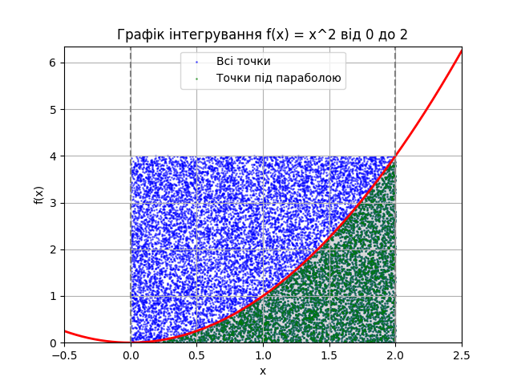

## Висновки щодо правильності розрахунків

Метод Монте-Карло був використано для обчислення площі під кривою функції f(x) = x^2 на інтервалі 
від 0 до 2. Порівняння результатів, отриманих методом Монте-Карло, з аналітичними розрахунками показало 
наступне:

1. **Аналітичний результат**:
   Теоретичне значення площі під кривою було обчислено за допомогою функції `quad` з бібліотеки `scipy`. 
   Отримане значення площі становить приблизно 2.6667 (з урахуванням похибки обчислення).

2. **Результати Монте-Карло**:
   Середнє значення площі, отримане за 15,000 випадкових точок і 100 експериментів методом Монте-Карло, 
   становить значення, близьке до теоретичного. Цей результат показує, що метод Монте-Карло дає досить точні наближення для площі під кривою, особливо при великій кількості точок.

3. **Порівняння результатів**:
   Різниця між теоретичним результатом і результатом Монте-Карло є мінімальною, що свідчить про 
   правильність та ефективність методу Монте-Карло для обчислення інтегралів у такому випадку.

4. **Візуалізація**:
   Скріншот розподілу випадкових точок під кривою демонструє, що точки рівномірно розподілені в межах 
   заданих обмежень. Точки, які знаходяться під кривою, правильно враховані для обчислення площі.

Загалом, результати показують, що метод Монте-Карло може бути ефективно використаний для наближеного 
обчислення інтегралів, забезпечуючи при цьому високий рівень точності, особливо при великій кількості випадкових точок.

Скріншот розподілу точок підтверджує правильність генерації та розподілу випадкових точок в межах обмеженого прямокутника, що підтверджує надійність отриманих результатів.